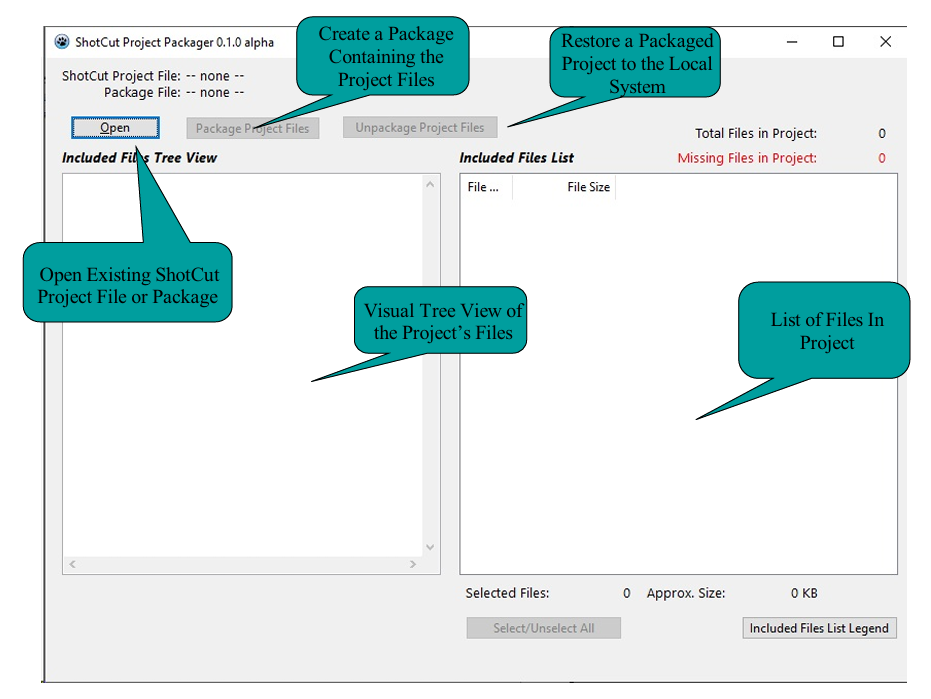
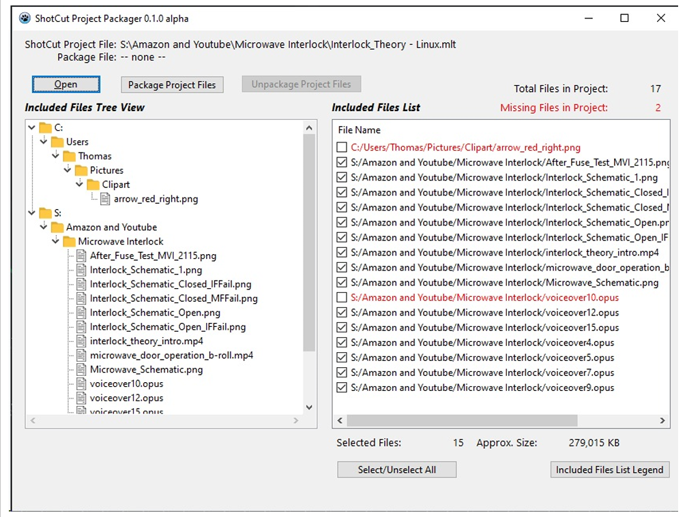
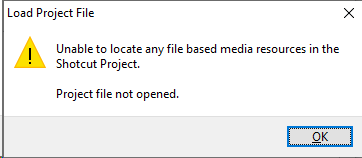
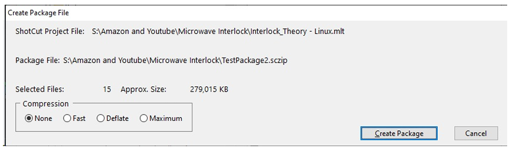
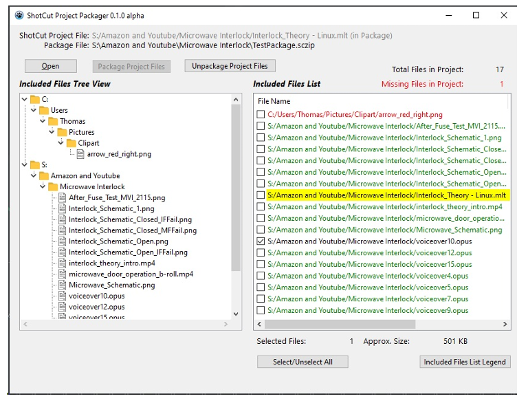
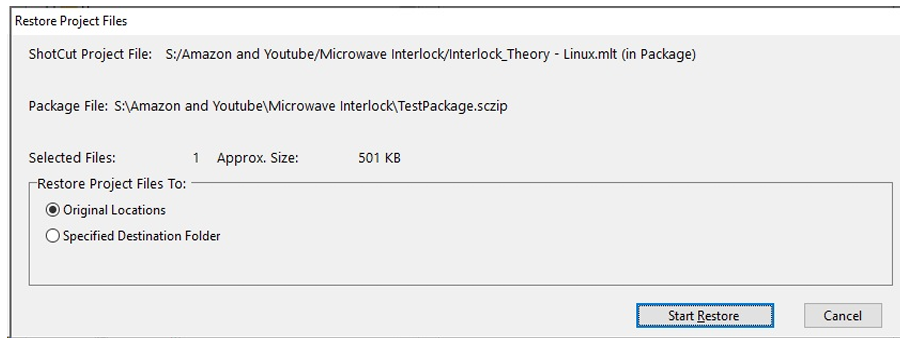
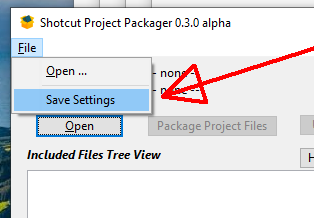
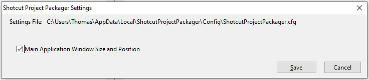

# ShotCut Project Packager Application

### Purpose

* Provides a simple way to view the list of files that are included within a ShotCut Project.

* Provides a visual confirmation regarding the availability of the files on the current system.

* Provides a mechanism to gather available included files into a single ZIP container (called a Package). This single container provides a convenient method for storing all of the project elements once the project is complete, as well as a simple way to transfer a project and its included files between systems.

## Alpha/Beta Stage Goals:

* Verify that the application properly parses a ShotCut project file. I wrote the parser by examining a small sample of project mlt files, so I am unsure if I have all the XML tag inclusions and exclusions correct. Check that all files that are used in the project are listed, with the correct path and names. Other references that are not file system objects should not be included.
* Root out any serious bugs, crashing, failure to read or write the correct information into or out of the Package Files.
* Input on functionality improvements so that I have a roadmap for what features to implement next.
  Please provide commentary eithier by opening up an issue on the issues page on github, or possibly within the thread on the ShotCut forum.

## Alpha-Stage Installation Instructions

Currently, there are no installers for either Windows or Linux. Simply download the appropriate release from the Releases Link and copy the compiled executable into a folder of your choice. I don't think that there are any dependencies that aren't already present in the base OS, although I may be wrong especially with Linux. 
I do plan on eventually having a simple Inno based installer (for Windows) to make end-user use easier.

#### Windows Suggestions

Create a folder in the hidden ProgramData folder on the boot drive, and run the software from there.

#### Linux Suggestions

Create a folder in the user home folder, copy the compiled executable into that folder, mark it as an executable, and run it from there.

### Compiling from Source

The application is written in FreePascal, under the Lazarus 4.0 IDE. To compile and build your own executable, these steps should work:

1. Download and install Lazarus 4.0 on your system. (https://www.lazarus-ide.org/)
2. Extract the source files from the release zip file and place in a writeable folder somewhere on your system.
3. Open up the project in Lazarus (select the ShotcutProjectPackager.lpi file)
4. Set the appropriate build mode on the toolbar or in project options.
5. Select Build from the Run menu to build the project into a compiled executable.

## Basic Usage Instructions

### Main UI Overview

### Working with an Existing Project

Click on the Open button, navigate to any existing ShotCut Project file (.mlt extension), and select it.

The application opens and reads the contents of the project file, looking for references to files that are included within the project.

* The Included Files Tree View on the left shows an explorer style view of where all of the included files are stored.
* The Included Files List on the right shows a sorted normalized list of all the files in the project.
  * The list is color coded. There is a full legend displayed by pressing the "Included Files List Legend" button below the list.
  * Files that exist on the system are shown in black, and are checked by default. This allows quick and easy project packaging of the available files.
  * Files that do not exist are shown in $${\color{red}RED}$$, and are unchecked. (They can't be selected because they don't exist on the computer)
* Statistics and info are provided about the project as a whole, including file count and size.

If no file-based media resources can be found in the project, the following information dialog will be displayed:

All file based media must have a valid file extension in order to be recognized.

### Creating A Package of the Included Files

Select the "Package Project Files" button with at least one included file checked.

The application will display a warning dialog if there are missing files.

The application will display a warning if not all of the included files are checked.

Both of these warnings are designed to prevent an incomplete project from being packaged (although there may be legitimate reasons why only a portion of the included files should be checked). For example, if a project has a reference to a very large media file that is permanently available, then it might be wise to exclude that file from inclusion in the Project package.

After any warnings are acknowledged, the application prompts for the name of the Package file to create. This name is arbitrary and does not need to match the project file name. The actual project file will be stored in the Package along with the included files.

Package files are standard zip files, but to differentiate files created and used by the packager application they have an extension of ".sczip".

Once the desired name is specified, the final Package options dialog will be displayed:

#### Note About Compression

While zip compression might make some files smaller, the vast majority of large media files do not compress well or at all. Therefore No compression is selected by default. This reduces the time it takes to build the package file substantially, with virtually no effect to the size of the resulting package file.

Select "Create Package" to build the package file.

#### Note about the Package "Zip" file

While the resulting package file can be opened with standard zip file readers such as 7-zip, the file naming structure uses absolute paths to permit restoration back to the exact original file locations that ShotCut expects. Therefore it is advised to only use the ShotCut Project Packager Application when extracting project files.

### Working with an Existing Project Package (.sczip)

Click on the Open button, navigate to any existing ShotCut Package file (.sczip extension), and select it.

The application opens and reads the contents of the package, extracts the 1st (and should be only) ShotCut project file (.mlt extension), and then parses the extracted project file, looking for references to files that are included within the project.

The resulting main screen is similar to what is displayed when working with a local project file.

* The ShotCut Project filename is shown in a light gray, with the (in Package) suffix to indicate that it has been opened from within the Package.
* The Package File that is active is shown next to the "Package File" field near the top of the main window.
  

The Included Files List employs a variety of additional colors to indicate file status, and implements different selection logic.

* Files listed in BLACK exist only in the package file, not on the local system, and are checked for restoration by default.
* Files listed in $${\color{green}GREEN}$$ exist in the package file AND in the local file system and have the same size. They are considered identical and are unchecked by default. They can be checked if a restoration is desired. Be aware that currently date and time is NOT used to determine equivalency.
* Files listed in $${\color{gold}YELLOW}$$ highlight exist in the package file AND in the local file system but do NOT have the same size. These files are unchecked by default. They can be checked if a restoration is desired.
* Files listed in $${\color{red}RED}$$ do not exist in the package file, nor can they be found on the local system. These files are missing and cannot be checked for restoration.

### Unpacking Files from the Package

Select the "Unpackage Project Files" button with at least one included file checked.

Restore Project Files dialog will be displayed:

Pay special attention to the "Restore Project Files To:" option.

* Selecting "Original Locations" will extract the files from the package and restore them to the absolute location as shown in the Included Files List. This is the exact location from which the files were originally packaged, and are the locations that ShotCut expects in the project file. This is the default.
* Selecting "Specified Destination Folder" will attempt to extract the files into a single folder. You will be prompted to select a local folder (or create one) when choosing this option.

#### Considerations when Restoring to Original Locations

1. No attempt is made in advance to ensure that the location is available and is writable by the user. While all the sub-folders will be created if needed, the basic drive letter (Windows) or mount point (Linux) must exist otherwise an error will occur.
2. Existing files will be overwritten without warning or confirmation.

#### Considerations when Restoring to Specified Destination Folder

1. No attempt is made to resolve file name collisions. Currently files with identical names located in different folders will be overwriiten without warning or confirmation. No guarantee can be made regarding which colliding file will survive. If this is a concern, multiple restorations can be performed checking a non-conflicting subset of the included files each time and adjusting the restored file names manually after each restoration.
2. Existing files will be overwritten without warning or confirmation.
3. The ShotCut project file will be looking for the files in their original location. Upon 1st opening the restored project file, you will have to go through the ShotCut file relinking process in order for the project to utilize the files in the new location.

Select "Start Restore" to extract the checked files from the package file.

---

### Saving & Restoring the Application Window Size and Position

Starting with release 0.3.0 there is new functionality to store the application window size and position on a per-user basis.
By default, the Shotcut Project Packager Application will be displayed centered on the user's primary desktop.

* Once started, the main window can be moved anywhere on the user's desktop by click and drag on the title bar.
* The window can be resized smaller or larger(there is a rational "minimum" size) by click and drag on the edge of the window.
  In order to retain the  new window size and position between sessions, the application settings need to be saved:
1. From the main menu, select File, then select Save Settings.
   
2. The save settings confirmation dialog will be shown.
   Ensure that the option "Main Application Window Size and Position" is checked. (Currently it is the only option, but it is anticipated there will be other settings in the future.) 
   The location and name of the application settings file is also shown at the top of the dialog. This is informational only and can not be changed. However, it is possible to edit this file outside of the application if necessary.
   
3. Click on Save. The current application window size and position will be saved in the Settings file in INI style format.

After the settings file has been created, when the application is subsequently launched the settings file will be read and the window size and position will be restored.

*Note: There are built-in checks to ensure that the application window is drawn in a location that is valid and viewable in the current session. However, as a fail-safe this file may be deleted or edited to correct for unanticipated changes to the geometry of the user's desktop.*

---
